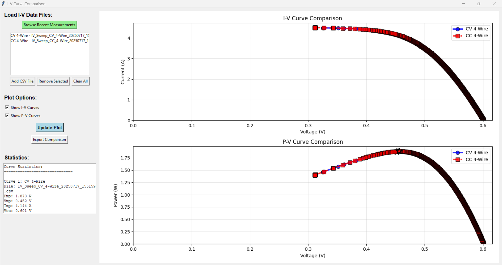

# BK8601-GUI

A comprehensive Python-based GUI application for controlling the **BK Precision 8601 DC Electronic Load**, designed for automated I-V curve measurements of solar cells and other photovoltaic devices. Features both **CC (Constant Current)** and **CV (Constant Voltage)** measurement modes with real-time plotting and advanced curve comparison capabilities.


## 📸 Screenshots

### Main Interface

*BK8601-GUI main interface with measurement controls and real-time plotting*

### Curve Comparison Tool

*Advanced multi-curve analysis with automatic parameter extraction*

### Real-time Measurement

*Live I-V and P-V curves during measurement sweep*

---

## ✨ Features

### 🔬 **Measurement Capabilities**
- 🖥️ **Modern GUI** built with Tkinter - intuitive and responsive interface
- 🔌 **Hardware Support** - Compatible with BK8601 via PyVISA or simulated mode for testing
- 📊 **Real-time Plotting** - Live I-V and P-V curves with Matplotlib integration
- 🧪 **Dual Sensing Modes** - 2-Wire and 4-Wire sensing for different accuracy requirements
- ⚙️ **Operation Modes** - Constant Current (CC) and Constant Voltage (CV) sweep modes
- 🔐 **Safety Protection** - Configurable current/voltage limits to protect DUT
- ⏱️ **Configurable Timing** - Adjustable step delays for proper settling
- ⌨️ **Keyboard Shortcuts** - Enter to start, Escape to stop measurements

### 💾 **Data Management**
- 💾 **Flexible Export** - Save data as CSV and plots as high-resolution PNG
- 📁 **Smart Organization** - Automatic file organization by date (`/output/YYYY-MM-DD/`)
- 💡 **Parameter Extraction** - Automatic calculation and highlighting of Maximum Power Point (Pmp, Vmp, Imp)
- 💼 **Session Persistence** - Saves and restores all settings between sessions
- 📈 **Rich Metadata** - CSV files include measurement parameters and instrument settings
- 🏷️ **Smart Naming** - Descriptive filenames with mode, sensing type, and timestamp

### 📊 **Advanced Analysis & Comparison**
- **🆕 Multi-Curve Comparison** - Side-by-side analysis of multiple I-V measurements
- 📈 **Historical Data Loading** - Browse and load CSV files from any measurement session
- 🔍 **Intelligent Detection** - Automatic identification of measurement mode and sensing type
- 📋 **Complete PV Analysis** - Calculate key photovoltaic parameters:
  - **Pmp** - Maximum Power Point
  - **Vmp** - Voltage at Maximum Power
  - **Imp** - Current at Maximum Power  
  - **Voc** - Open Circuit Voltage
  - **Isc** - Short Circuit Current
  - **FF** - Fill Factor percentage
- 🎨 **Visual Differentiation** - Distinct colors, markers, and line styles for each curve
- 💾 **Export Comparisons** - Save comparison plots in high resolution (PNG/PDF)
- 🧮 **Statistics Panel** - Real-time parameter calculations and performance metrics

---

## 🚀 Quick Start

### Prerequisites
- **Python 3.7+** 
- **Windows OS** (tested on Windows 10/11)
- **BK Precision 8601** (optional - simulation mode available)
- **NI-VISA Runtime** (for hardware communication)

### Installation

1. **Clone the repository**
   ```bash
   git clone https://github.com/mathieu-martinent/bk8601-gui.git
   cd bk8601-gui
   ```

2. **Install dependencies**
   ```bash
   pip install -r requirements.txt
   ```

3. **Run the application**
   ```bash
   python src/main.py
   ```

### First Run
1. The application will start in **Simulated Mode** by default
2. Configure your measurement parameters (start/end/step values)
3. Set appropriate protection limits for your DUT
4. Click **"Start Sweep"** to begin measurement
5. Use **"Compare Curves"** to analyze multiple measurements

---

## 📁 Project Structure

```
bk8601-gui/
├── src/
│   ├── main.py                    # Main application with GUI and comparison tools
│   ├── last_settings.json         # Auto-saved user preferences
│   └── manual_tests/              # Development and testing files
│       └── CC-CV_modes_plan.ods
├── requirements.txt               # Python dependencies
├── output/                        # Auto-generated measurement data
│   ├── 2025-01-15/               # Daily measurement folders
│   │   ├── IV_Sweep_CC_4-Wire_20250115_143052.csv
│   │   ├── IV_Sweep_CC_4-Wire_20250115_143052.png
│   │   └── IV_Sweep_CV_2-Wire_20250115_150233.csv
│   └── 2025-01-16/
│       └── ...
└── README.md
```

---

## 🔧 Usage Guide

### Basic Measurement Workflow

1. **Select Instrument**
   - Choose "Simulated Instrument" for testing
   - Select your BK8601 from detected VISA instruments

2. **Configure Measurement**
   - **Mode**: CC (sweep current) or CV (sweep voltage)
   - **Sensing**: 2-Wire (standard) or 4-Wire (high accuracy)
   - **Range**: Set start, end, and step values
   - **Protection**: Set voltage and current limits (mandatory for safety)
   - **Timing**: Adjust step delay for DUT settling time

3. **Run Measurement**
   - Click "Start Sweep" or press Enter
   - Monitor real-time I-V and P-V plots
   - Stop anytime with "Stop" button or Escape key

4. **Analyze Results**
   - View calculated PV parameters (Pmp, Voc, Isc, etc.)
   - Save data and plots if desired
   - Use "Compare Curves" for multi-measurement analysis

### Advanced Features

#### Curve Comparison Tool
1. Click **"Compare Curves"** to open comparison window
2. Use **"Browse Recent Measurements"** to load historical data
3. Select multiple CSV files for side-by-side comparison
4. Toggle I-V and P-V curve display
5. View detailed statistics for all loaded curves
6. Export comparison plots for reports

#### Safety Features
- **Mandatory Protection Limits** - Voltage limits required in CC mode, current limits in CV mode
- **Real-time Monitoring** - Continuous safety checks during measurement
- **Graceful Shutdown** - Safe instrument state on errors or user stop
- **Input Validation** - Comprehensive parameter checking before measurement

---

## 📊 Measurement Modes

### Constant Current (CC) Mode
- **Sweep Variable**: Current (A)
- **Measured Variable**: Voltage (V)
- **Best For**: Forward bias I-V curves, diode characterization
- **Required Protection**: Voltage limit
- **Typical Range**: 0-5A current, 0-30V voltage

### Constant Voltage (CV) Mode  
- **Sweep Variable**: Voltage (V)
- **Measured Variable**: Current (A)
- **Best For**: Reverse bias measurements, breakdown analysis
- **Required Protection**: Current limit
- **Typical Range**: 0-30V voltage, 0-5A current

### Sensing Modes
- **2-Wire**: Standard connection, adequate for most applications
- **4-Wire**: Kelvin sensing, eliminates lead resistance effects for high-accuracy measurements

---

## 📈 Data Format

### CSV File Structure
```csv
Current (A),Voltage (V),Power (W)
0.000,25.234,0.000
0.100,24.987,2.499
0.200,24.756,4.951
...

Parameter,Value
Mode,CC
Sense,4-Wire
Start (A),0.0
End (A),5.0
Step (A),0.1
Voltage Limit (V),30.0
Current Limit (A),
Step Delay (s),0.5
Instrument,Simulated Instrument
```

### Filename Convention
`IV_Sweep_{MODE}_{SENSE}_{TIMESTAMP}.csv`

Examples:
- `IV_Sweep_CC_4-Wire_20250115_143052.csv`
- `IV_Sweep_CV_2-Wire_20250115_150233.csv`

---

## 🔍 Troubleshooting

### Common Issues

**No Instruments Detected**
- Install NI-VISA Runtime
- Check USB/Ethernet connection to BK8601
- Use "Simulated Instrument" for testing

**"Protection Triggered" Error**
- Verify protection limits are appropriate for your DUT
- Check that DUT can handle the programmed current/voltage
- Ensure proper electrical connections

**CSV Loading Errors in Comparison**
- Verify CSV file has correct column headers
- Check for corrupted or incomplete data files
- Ensure file contains numeric measurement data

**Application Won't Start**
- Check Python version (3.7+ required)
- Install missing dependencies: `pip install -r requirements.txt`
- Verify tkinter is available: `python -m tkinter`

### Performance Tips
- Use appropriate step delays (0.1-1.0s) for accurate measurements
- Set realistic protection limits to avoid frequent trips
- Close comparison window when not needed to save memory
- Regularly clean old measurement files to manage disk space

---

## 🛠️ Development

### Requirements
```txt
matplotlib>=3.5.0
pandas>=1.3.0
pyvisa>=1.11.0
pyvisa-py>=0.5.0
```

### Architecture
- **Main Application** (`IVAppCC`): Core measurement and GUI functionality
- **Comparison Tool** (`ComparisonApp`): Multi-curve analysis and visualization
- **Simulated Instrument**: Testing without hardware
- **Thread Safety**: Non-blocking measurements with progress feedback

### Contributing
1. Fork the repository
2. Create a feature branch (`git checkout -b feature/amazing-feature`)
3. Commit your changes (`git commit -m 'Add amazing feature'`)
4. Push to the branch (`git push origin feature/amazing-feature`)
5. Open a Pull Request

---

## 📄 License

This project is licensed under the MIT License - see the [LICENSE](LICENSE) file for details.

---

## 🙏 Acknowledgments

- **BK Precision** for the 8601 DC Electronic Load
- **PyVISA** community for instrument communication tools
- **Matplotlib** team for excellent plotting capabilities
- **Pandas** developers for robust data handling

---

## 📞 Support

For questions, issues, or feature requests:
- 🐛 [Report bugs](https://github.com/mathieu-martinent/bk8601-gui/issues)
- 💡 [Request features](https://github.com/mathieu-martinent/bk8601-gui/issues)
- 📧 Contact: mathieumartinent09@gmail.com

---

**Made with ❤️ for the photovoltaic research community**
